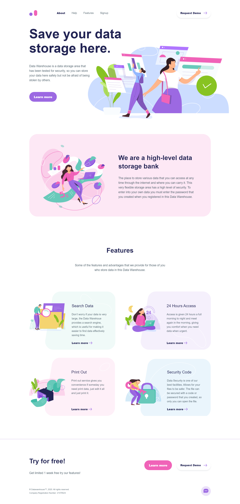

# Web
# Lab №2. Simple landing page

## <b>Description:</b> Create a landing page following the given design (Figma).

## <b>Requirements:</b>

- Use of semantic tags (`<header>`, `<nav>`, `<ul>`, `<footer>`, etc.) wherever is necessary
- All fonts, colour palette, elements’ sizes must strictly match the design.
- Pixel perfect is also not required, BUT your website should visually match the design template (i.e. If the element is horizontally centred on the design, it should look centred on the website)
- All class names must not be meaningless (i.e. class=”myClass”) and should follow the same naming convention, preferably BEM, but you could come up with your own (just be consistent)
- Basic cross-browser support (website should look correctly on last versions of modern browsers (Chrome, Safari, Edge)
- For now, responsiveness is not required.
- Add 3 animations.
- Adapt to the mobile version
- Add burger menu.

---



---

## Design
https://www.figma.com/file/XT2jhcwmHBGxAjIBJsMnH0/LabWork1-V9

---

## Demo
https://ssovile.github.io/Web/

---

## Installation

1. Clone repo to any folder you want
2. Open index.html in you browser

##OR

1. Dowload and install Node from [official Node.js website](https://nodejs.org/)
2. Install the **npx** util by running the following command:
```
$ npm i -g npx
```